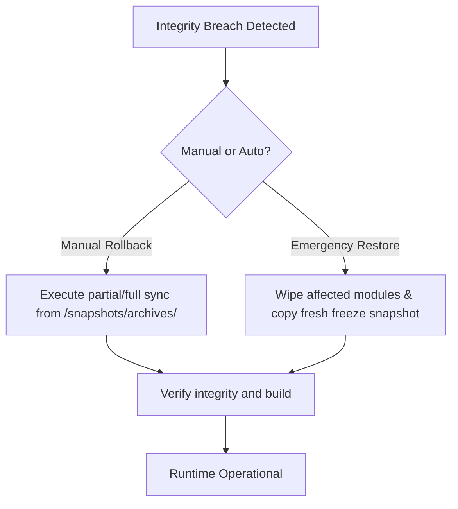

# ORION — RESTORE & RECOVERY GUIDE

This document serves as the primary operational manual for restoring core services, verifying cryptographic locks, and managing emergency rollbacks of stabilized systems.

---

## 🛠️ Rollback & Restore Strategies



### 1. Manual Full Rollback
If a core runtime system undergoes catastrophic regression or unauthorized design changes:
1. Stop the running Node server instance.
2. Wipe the compromised runtime directory (e.g. `client/core/task-runtime/`).
3. Copy the corresponding frozen backup from `snapshots/archives/task-runtime/` back to its original location.
4. Execute validation checks to secure the restoration.

### 2. Partial Rollback
If only a specific file (e.g., `VoiceRuntimeManager.ts`) exhibits anomalies:
1. Locate the file hash violation from the integrity logs.
2. Copy ONLY the single file from `snapshots/archives/voice-runtime/VoiceRuntimeManager.ts` back to `client/core/voice-runtime/VoiceRuntimeManager.ts`.
3. Re-run the integrity verification script.

### 3. Emergency Disaster Restore
In case of full workspace corruption where files are missing or deleted:
1. Wipe the entire `client/core/` folder.
2. Recursively copy all archived subfolders from `snapshots/archives/` back into `client/core/`.
3. Copy `snapshots/archives/TriggerCMDService.ts` to `server/services/TriggerCMDService.ts`.
4. Run `npm run build` to confirm compilation.

---

## 🔍 Validation & Verification Commands

Use the following commands inside your development terminal to verify code locks:

### A. Run Integrity Check
To verify that no architectural freeze has been broken or modified:
```bash
node snapshots/verify-integrity.js
```

### B. Update Code Lock (Locking Current Files)
To record a new stable snapshot (e.g., when moving from `Phase 18` to `Phase 18.3` after official approval):
```bash
node snapshots/verify-integrity.js --lock
```

### C. Build Check
Validate that the snapshots and configuration files have absolutely zero impact on Vite dynamic chunking:
```bash
npm run build
```

---

## 📝 Freeze Verification Checklist

When preparing a release candidate, verify the following:

- [ ] Run `node snapshots/verify-integrity.js` and get a `GREEN` (PASS) response.
- [ ] Inspect the active websocket connections; ensure no reconnection loops occur.
- [ ] Verify that `dist/server.cjs` has compiled with no missing dynamic external imports.
- [ ] Check if `hydrationBarrierActive` resolves correctly at application launch.
